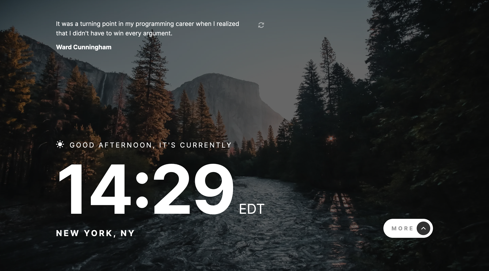

# Frontend Mentor - Clock app solution

This is a solution to the [Clock app challenge on Frontend Mentor](https://www.frontendmentor.io/challenges/clock-app-LMFaxFwrM). Frontend Mentor challenges help you improve your coding skills by building realistic projects.

## Table of contents

- [Overview](#overview)
  - [The challenge](#the-challenge)
  - [Screenshot](#screenshot)
  - [Links](#links)
- [My process](#my-process)
  - [Built with](#built-with)
- [Author](#author)
- [Acknowledgments](#acknowledgments)

**Note: Delete this note and update the table of contents based on what sections you keep.**

## Overview

### The challenge

Users should be able to:

- View the optimal layout for the site depending on their device's screen size
- See hover states for all interactive elements on the page
- View the current time and location information based on their IP address
- View additional information about the date and time in the expanded state
- Be shown the correct greeting and background image based on the time of day they're visiting the site
- Generate random programming quotes by clicking the refresh icon near the quote

### Screenshot

### Links

- Solution URL: [Add solution URL here](https://www.frontendmentor.io/solutions/react-stylecomponents-vite-mobile-first-SkCB8djzc)

- Live Site URL: [Add live site URL here](https://clock-app-liard.vercel.app/)

## My process

Coming soon...

#### Theme

Theming is based on the time of day, I used the [Suncalc](https://github.com/mourner/suncalc) to trigger the correct theme based on the current position of the sun.

### Built with

- Mobile-first workflow
- [NextJS](https://nextjs.org/) - React Framework
- [SWR](https://swr.vercel.app/) - React Hooks for Data Fetching
- [Styled Components](https://styled-components.com/) - For styles
- [Suncalc](https://github.com/mourner/suncalc) - for calculating sun position, sunlight phases (times for sunrise, sunset, dusk, etc.), moon position and lunar phase for the given location and time.

## Author

- Website - [www.sergioswork.com](https://www.sergioswork.com)
- Frontend Mentor - [@sergioreynoso](https://www.frontendmentor.io/profile/sergioreynoso)
- LinkedIn - [@sreynoso](https://www.linkedin.com/in/sreynoso/)

## Acknowledgments

I would like to thank [Jonas Schmedtmann](https://codingheroes.io) for all his great [UDemy courses](https://www.udemy.com/user/jonasschmedtmann/), as well as [Kevin Powell](https://www.kevinpowell.co) for all the great css content and the whole [UI.dev](https://ui.dev/) community.
